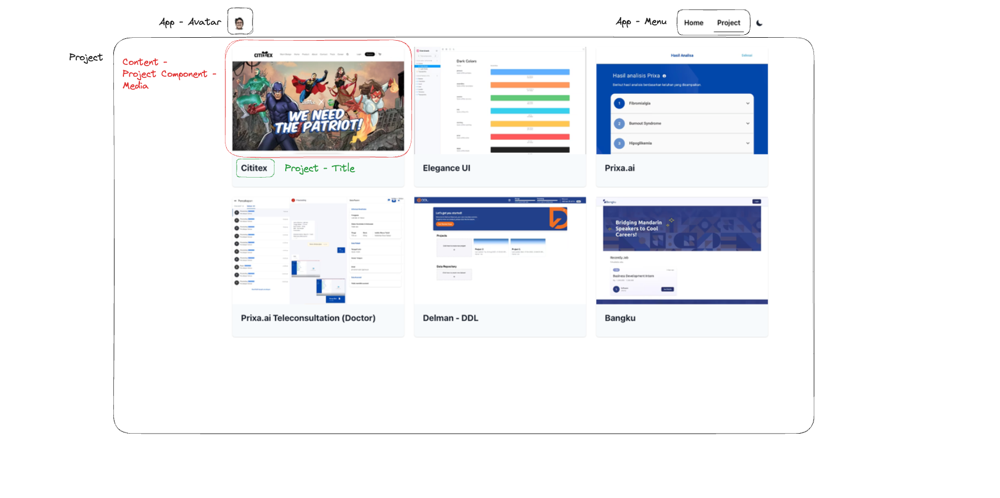
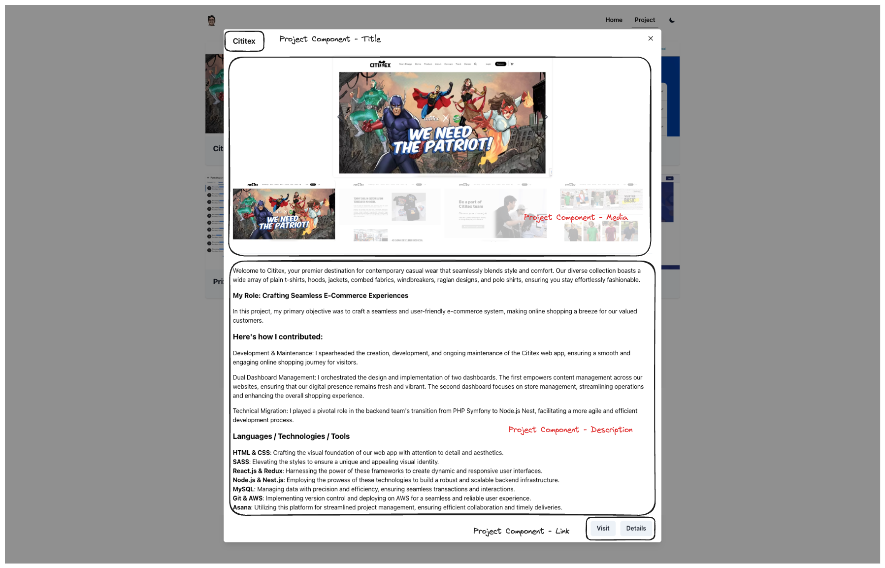

# Personal Website

This project is source-available for you to use for creating a personal website.

Requirement, Need install [Node.js](https://nodejs.org/en) v18+ and [NPM](https://www.npmjs.com/) v9+

Stack Technology I used In this project:

- [Next.js](https://nextjs.org/)
- [ESLINT](https://eslint.org/)
- [GrahpQL](https://graphql.org/)
- [Chakra-UI](https://chakra-ui.com/)
- [Docker](https://www.docker.com/)
- More... check [package.json](https://github.com/ibrahimtrg18/ibrahim-tarigan/blob/main/package.json)

## Getting Started

### Development

Clone the project to a local machine:

```bash
git clone https://github.com/ibrahimtrg18/ibrahim-tarigan.git
```

you need to copy `.env.template` to the root folder as a `.env` file and fill it with your environment variables.

```bash
HYGRAPH_GRAPHQL_URI=[YOUR HYGRAPH_GRAPHQL_URI]
SITE_URL=[YOUR SITE HOST]
GOOGLE_ANALYTICS_ID=[YOUR GOOGLE ANALYTICS ID]
```

Run Development in Local machine:

```bash
npm run dev
```

Open [http://localhost:3000](http://localhost:3000) with your favorite browser.

For Content CMS, Please do the following steps:

> NOTE: If you don't have Hygraph Template CMS, please go to [Clone Hygraph](https://app.hygraph.com/clone/616e21b4e9d24da6b472ff0462392a89?name=ibrahim-tarigan)

Understanding the CMS data structure:

1. Home Page
   
2. Projects Page
   
3. Project Detail Modal
   

## References

To learn more about Next.js, take a look at the following resources:

- [Next.js Documentation](https://nextjs.org/docs) - Learn about Next.js features and API.
- [Hygraph](https://hygraph.com/) - a Build Scalable Content Experiences
- [Google Analytics](https://analytics.google.com) - Monitoring and Analytics your website.

You can check out [the Next.js GitHub repository](https://github.com/vercel/next.js/) - your feedback and contributions are welcome!

## Deploy on Vercel

The easiest way to deploy your Next.js app is to use the [Vercel Platform](https://vercel.com/new?utm_medium=default-template&filter=next.js&utm_source=create-next-app&utm_campaign=create-next-app-readme) from the creators of Next.js.

Check out our [Next.js deployment documentation](https://nextjs.org/docs/deployment) for more details.
